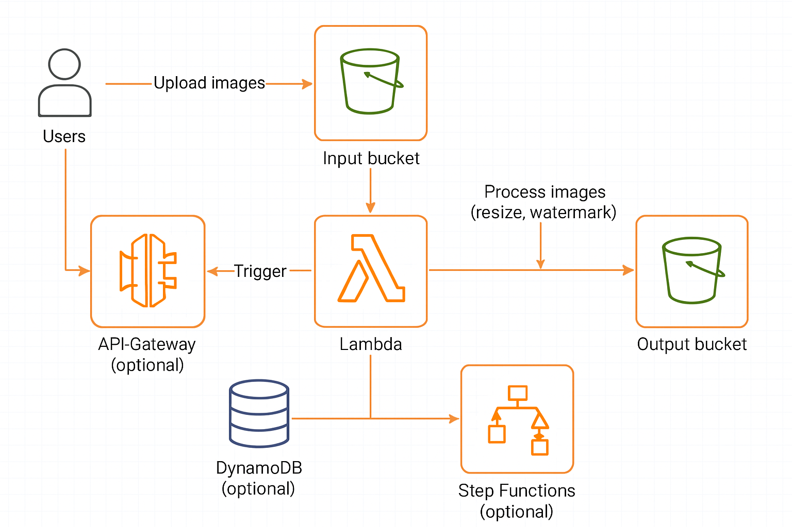

# 🖼️ Serverless Image Processing Pipeline on AWS

This project implements a **fully serverless, event-driven image processing pipeline** using core AWS services. It automatically adds a watermark to uploaded images and stores metadata for later retrieval via API.

---

## 📌 Overview

When a user uploads an image to the `zeno-original-images` S3 bucket:

1. **S3 triggers a Lambda function**
2. The image is processed using **Pillow** (watermark added)
3. The processed image is stored in the `zeno-processed-images` bucket
4. Metadata (image ID, size, timestamp, etc.) is saved to **DynamoDB**
5. An API Gateway endpoint (`GET /images`) retrieves stored image metadata

---

## 🔧 Technologies Used

| Service         | Purpose                                  |
| --------------- | ---------------------------------------- |
| **S3**          | Input & output image storage             |
| **Lambda**      | Image processing logic (Python + Pillow) |
| **DynamoDB**    | Stores image metadata                    |
| **API Gateway** | Exposes REST endpoint to retrieve data   |
| **IAM**         | Role-based access control                |
| **CloudWatch**  | Logging and debugging                    |

---

## 📁 Folder Structure
```pil
├── lambda/  
│ ├── processor.py # Adds watermark & saves metadata  
│ ├── get_images.py # Returns image metadata via GET API  
│── policies/  
│ ├── lambda-s3-dynamodb-policy.json  
│ ├── lambda-dynamodb-read-policy.json  
├── project2_diagram.png # Architecture diagram  
├── README.md

```


## 🧠 How It Works

### ✅ Upload Flow:
- User uploads image to S3 (`zeno-original-images`)
- S3 triggers `imageProcessorLambda`
- Lambda:
  - Adds watermark using Pillow (via Lambda Layer)
  - Uploads processed image to `zeno-processed-images`
  - Stores metadata in DynamoDB

### ✅ Retrieve Flow:
- API Gateway `GET /images` calls `getImagesLambda`
- Lambda scans DynamoDB
- Returns JSON with all image metadata

---

## 🖼️ Sample API Response

```json
[
  {
    "ImageId": "example.jpg",
    "OriginalSize": 102400,
    "ProcessedSize": 98455,
    "ProcessedUrl": "https://zeno-processed-images.s3.amazonaws.com/processed/example.jpg",
    "CreatedAt": "2025-06-12T15:25:14Z"
  }
]

```


## 🔐 IAM Roles & Policies

Each Lambda function in this project has its own IAM Role with specific permissions.

### ✅ IAM Roles Created:

| Lambda Function        | IAM Role Name              | Attached Policy File                  |
|------------------------|----------------------------|----------------------------------------|
| `imageProcessorLambda` | `role-image-processor`     | `lambda-s3-dynamodb-policy.json`       |
| `getImagesLambda`      | `role-get-images`          | `lambda-dynamodb-read-policy.json`     |

---

### 📂 Policy Files

Stored in  policies/`:

| Policy File                     | Description                                |
|----------------------------------|--------------------------------------------|
| `lambda-s3-dynamodb-policy.json`| Grants access to S3 buckets and DynamoDB write |
| `lambda-dynamodb-read-policy.json`| Grants read-only access to DynamoDB        |
## 🔐 IAM Roles & Policies

Each Lambda function has a dedicated IAM Role with scoped permissions.

### ✅ Roles Created:

| Lambda Function        | IAM Role Name          | Attached Policy File               |
| ---------------------- | ---------------------- | ---------------------------------- |
| `imageProcessorLambda` | `role-image-processor` | `lambda-s3-dynamodb-policy.json`   |
| `getImagesLambda`      | `role-get-images`      | `lambda-dynamodb-read-policy.json` |


-----
## 🚀 Deployment Steps

1. Create the required S3 buckets
    
2. Deploy Lambda functions
    
3. Attach the correct IAM roles and layer
    
4. Connect `imageProcessorLambda` to S3 trigger
    
5. Deploy `getImagesLambda` behind API Gateway (`GET /images`)
    
6. Upload image to S3 and call the API to verify metadata


## 📊 Architecture Diagram





## 🎥 Demo Video

Click the image below to watch a full demo of the project:

[](https://youtu.be/g5Yg5QN_ctA)


